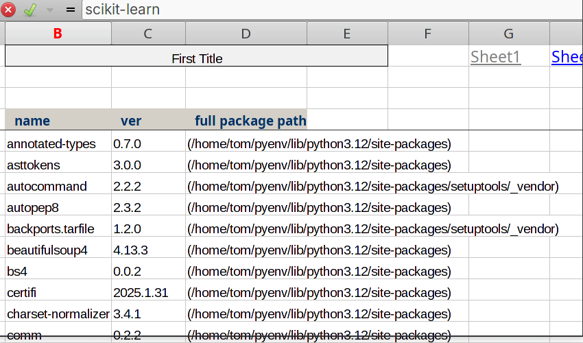

# Xlreport – easily and quickly transfer data to an excel file


* [General info](#general-info)
* [Setup](#setup)

## General info
The module allows you to quickly create a nicely formatted excel file from a sequence of data with minimal effort.
```python
import numpy as np
from numpy.random import default_rng
arr = default_rng(42).random((100, 4)) #generate some random data

import xlreport as xl
header = ['col1', 'col2', 'col3', 'col4']
#save data to excel and immediately open the file
xl.save_list("test.xlsx", arr. header, title="Test numpy") 
```

 
It is a useful tool for data inspection, as well as for simply creating reports. It is equally easy to create a file containing multiple sheets and links to them.

## Screenshots

Example of multisheet file.
By default, the header cells are frozen to make it easier to browse multiple rows of data.

```python

import xlreport as xl
#some example data
data1 = xl.get_packages()
data2 = xl.generate_random_data(20)
data3 = [(x, y) for x, y in xl.system_info().items()]
#create file
exfile = xl.Exfile("test_multisheet_file.xlsx")
exfile.write(data1, title="Current user packages")
exfile.write(data2, title="Random data")
exfile.write(data3, title="System Info", wrap=True)
exfile.add_links()
exfile.save()
xl.open_file("test_multisheet_file.xlsx")
```

<p align="center">

<!-- If you have screenshots you'd like to share, include them here. -->
</p>


You can also easily set the width of the columns. In practice, it turned out that the easiest way is to just add spaces to the headers than entering width nubmers.

```python
header = ["Normal column    ", "Description - longer column          "]
```

The worksheet.autofit() method in the xlswriter package often gives incorrect results - if there is a longer string in the column, autofit() creates a column that fills the entire screen. Xlreport solves this problem.


## Setup

Place the xlreport.py file in the site-packages directory
```python
import site
print(site.getusersitepackages())
```
It only requires the xlswriter package installed.


